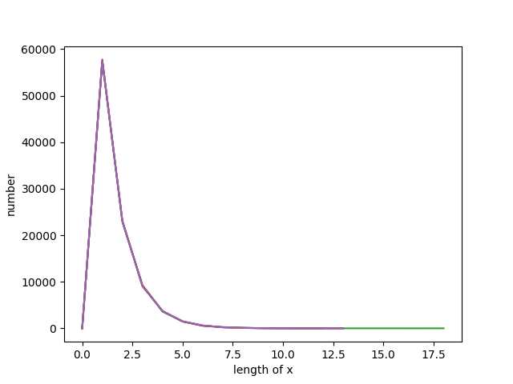
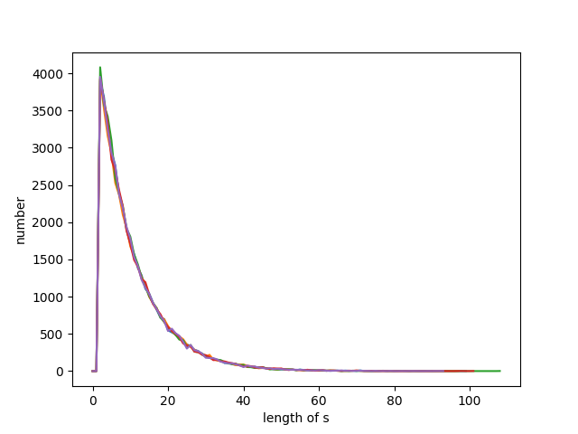

# 解析してわかったこと

## アルファベットの出る確率
全体では
a: 40%
b: 25%
c: 11%
d: 21%
くらい

## 虫食い文字列tの性質
虫食い文字列のxは全体の**40%**を占める.
xの中に入っている文字の確率は同様に確からしいっぽい
xの長さはせいぜい18くらいで, 長いものはとても少ない(指数関数的な減少)

## バラバラ文字列Sの長さ
最大の長さは100前後で, 長いものはとても少ない.(指数関数的な単調減少)

## マルコフ則が成り立っているかどうか調べたい
例えば複数文字列に区切ってみて, 調べてみる
1文字区切りである文字が出たあとの次の文字がでた確率を調べてみた
これはdata0のやつだが, 他のやつでも同じような確率になった

|前の文字|次の文字列|確率|
|---|---|---|
|a|a|40.176977128265754%|
||b|19.82826392994046%|
||c|20.008653840293984%|
||d| 19.986105101499795%|
|-|-|-|
|b|a| 40.047272513289265%|
||b| 19.925070124163906%|
||c| 9.892901276946313%|
||d| 30.134756085600518%|
|-|-|-|
|c|a| 30.07276005955002%|
||b|  30.13356817848231%|
||c| 10.00817764358055%|
||d| 29.785494118387117%|
|-|-|-|
|d|a| 49.835377588165734%|
||b| 40.27336594866563%|
||c| 0%|
||d| 9.891256463168634%|
